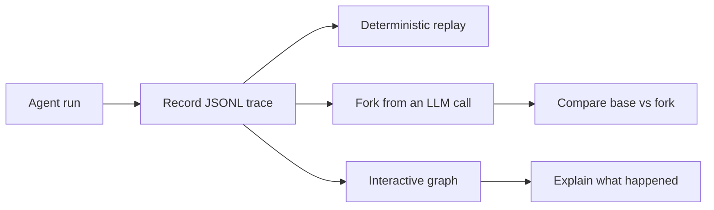

<p align="center">
  <h1 align="center">Replay Agent Recorder</h1>
  <p align="center"><strong>Local-first time-travel debugging for LLM agents.</strong></p>
  <p align="center">
    Record real agent runs, replay them deterministically, fork from any LLM call,
    and inspect the full model/tool/file trace as an interactive graph.
  </p>
</p>

<p align="center">
  <a href="https://github.com/Futuresis/replay-agent-recorder/actions/workflows/ci.yml"></a>
  
  
  
</p>

<p align="center">
  <a href="README.zh-CN.md">简体中文</a>
  ·
  <a href="docs/quickstart.md">Quickstart</a>
  ·
  <a href="docs/concepts.md">Concepts</a>
  ·
  <a href="docs/visualization.md">Visualization</a>
  ·
  <a href="docs/integrations.md">Integrations</a>
  ·
  <a href="docs/README.md">Docs</a>
</p>

---

## Why this exists

LLM agents are hard to debug because a single run can include non-deterministic model outputs, tool calls, retries, concurrent branches, file edits, and framework-specific control flow.

**Replay Agent Recorder turns an agent run into a structured trace you can inspect, replay, fork, compare, and share.**



Use it when you want to answer questions like:

| Question | Replay helps you |
|---|---|
| Why did my agent choose this tool? | Inspect the exact prompts, model responses, tool arguments, and tool outputs. |
| Can I reproduce a flaky failure? | Replay the same recorded responses and tool outputs without calling the model again. |
| What if this one LLM response had been different? | Fork from a recorded breakpoint and compare downstream behavior. |
| What changed between the base run and a fork? | Export a graph with changed, unchanged, new, missing, and downstream nodes. |
| Can I debug locally without sending traces to a hosted service? | Store traces as local JSONL files and render offline HTML reports. |

---

## What you get

| Capability | What it does |
|---|---|
| **Record** | Captures OpenAI-compatible chat completions, local tool calls, semantic events, async branches, and sandboxed file effects. |
| **Replay** | Reuses recorded LLM/tool outputs to reproduce an agent run deterministically. |
| **Fork** | Replays from a selected LLM breakpoint with an overridden output, assistant message, or request input. |
| **Visualize** | Exports summary JSON, Graph IR JSON, Mermaid, or a standalone offline HTML explorer. |
| **Integrate** | Provides a small public API, CLI runner, tool adapters, sandbox helpers, and generated wrapper scaffolds. |

Replay is **local-first**: traces are files on disk. It is useful for development, debugging, prompt experiments, eval trace generation, and agent behavior review.

> **Status:** alpha. The core record/replay/fork/graph workflow is usable, but public APIs and generated integration wrappers may still change.

---

## 5-minute demo, no API key required

The maintained demo is `test_agent/agent4`. It uses a fake LLM by default, so it works without network access or model credits.

```bash
git clone https://github.com/Futuresis/replay-agent-recorder.git
cd replay-agent-recorder

python -m venv .venv
source .venv/bin/activate
python -m pip install -U pip
python -m pip install -e ".[dev]"
```

Windows PowerShell:

```powershell
python -m venv .venv
.venv\Scripts\Activate.ps1
python -m pip install -U pip
python -m pip install -e ".[dev]"
```

Record, replay, then export an offline HTML graph:

```bash
python -m test_agent.agent4.replay_runner \
  --mode record \
  --run-id agent4-demo \
  --log-dir .replay/runs \
  --output test_agent/agent4/outputs/record.md

python -m test_agent.agent4.replay_runner \
  --mode replay \
  --run-id agent4-demo \
  --log-dir .replay/runs \
  --output test_agent/agent4/outputs/replay.md

python -m replay graph html .replay/runs/agent4-demo.jsonl \
  --output out/agent4-demo.html
```

Expected result:

- `.replay/runs/agent4-demo.jsonl` contains the structured trace.
- `record.md` and `replay.md` show the same deterministic synthesis.
- `out/agent4-demo.html` opens in a browser and works offline.

Create a fork by replacing one recorded LLM output:

```bash
python -m test_agent.agent4.replay_runner \
  --mode replay \
  --run-id agent4-demo \
  --log-dir .replay/runs \
  --breakpoint-record-uid rec_000001 \
  --override-output "manual seed override" \
  --fork-run agent4-demo-fork \
  --output test_agent/agent4/outputs/fork.md

python -m replay graph html .replay/runs/agent4-demo.jsonl \
  --fork .replay/runs/agent4-demo-fork.jsonl \
  --output out/agent4-demo-compare.html
```

More examples: [Quickstart](docs/quickstart.md) and [Agent4 demo guide](test_agent/agent4/README.md).

---

## Use it in your own agent

Install Replay once near process startup:

```python
import replay

replay.install(project_root=".")
```

Record a run:

```python
with replay.record("run-A", log_dir=".replay/runs"):
    await main()
```

Replay the same run:

```python
with replay.replay(base_run="run-A", log_dir=".replay/runs"):
    await main()
```

Fork from a recorded LLM call:

```python
with replay.replay(
    base_run="run-A",
    log_dir=".replay/runs",
    breakpoint_record_uid="rec_000003",
    override_output="Try the narrower search query instead.",
    fork_run="run-A-fork-001",
):
    await main()
```

For scripts, the CLI wrapper is often enough:

```bash
replay record run-A path/to/agent.py -- --agent-arg value
replay replay run-A path/to/agent.py -- --agent-arg value
replay fork run-A \
  --breakpoint-record-uid rec_000003 \
  --override-output "new assistant text" \
  path/to/agent.py -- --agent-arg value
```

---

## Record local tools

Replay records LLM calls automatically after `replay.install()`, but local tools must be routed through the tool protocol or an adapter.

```python
result = await replay.invoke_tool(
    "search",
    {"query": "replay debugging for agents"},
    lambda: search({"query": "replay debugging for agents"}),
    namespace="local",
    version="v1",
)
```

For tool registries and method-shaped clients:

```python
adapter = replay.MappingToolAdapter(tool_registry, namespace="local")
adapter.install()

method_adapter = replay.MethodToolAdapter(client, "call_tool", namespace="mcp")
method_adapter.install()
```

If tools modify local text files, wrap them in a sandbox capture:

```python
with replay.managed_sandbox(
    base_root="agent/sandbox_base",
    work_root="agent/sandbox",
) as capture:
    adapter = replay.MethodToolAdapter(
        client,
        "call_tool",
        namespace="workspace",
        fs_capture=capture,
    )
    adapter.install()

    with replay.record("run-A", log_dir=".replay/runs"):
        await main()
```

See [Tool Adapter Protocol](docs/tool-adapter-protocol.md) for detailed adapter patterns.

---

## Visualize traces

Replay can turn one or more JSONL traces into several graph formats.

```bash
python -m replay graph summary .replay/runs/agent4-demo.jsonl
python -m replay graph export-ir .replay/runs/agent4-demo.jsonl --output out/graph.json
python -m replay graph mermaid .replay/runs/agent4-demo.jsonl --group-by run --output out/graph.md
python -m replay graph html .replay/runs/agent4-demo.jsonl --output out/graph.html
```

The HTML explorer is static and read-only. It supports search, filters, focus, timeline navigation, node/edge inspection, evidence views, and base/fork diff highlighting.

For the React/XYFlow viewer, install Node dependencies and rebuild the vendored assets. Bundled viewer dependency notices live in [THIRD_PARTY_NOTICES.md](THIRD_PARTY_NOTICES.md):

```bash
npm install
npm run build:xyflow-viewer
python -m replay graph html .replay/runs/agent4-demo.jsonl \
  --renderer xyflow \
  --output out/graph-xyflow.html
```

Full reference: [Visualization guide](docs/visualization.md).

---

## Built-in integration wrappers

Replay includes wrapper templates for users who already have target agent projects checked out locally. Replay does not vendor those projects; you pass `--target-root` and, when needed, `--entry`.

| Integration | Status | Purpose |
|---|---|---|
| `integrations/my_agent` | template | Starting point for a custom integration wrapper. |
| `integrations/deepagents` | experimental wrapper | Best-effort wrapper for an existing DeepAgents checkout. |
| `integrations/open_deep_research` | experimental wrapper | Best-effort wrapper for Open Deep Research-style projects. |
| `integrations/open_swe` | experimental wrapper | Best-effort wrapper for Open SWE-style projects. |
| `integrations/swe_agent` | experimental wrapper | Best-effort wrapper for SWE-agent-style projects. |

Generate your own wrapper:

```bash
python -m replay scaffold integration \
  --name my-agent \
  --tool-style method \
  --framework auto
```

Read the integration model before relying on wrappers in production: [Integration guide](docs/integrations.md) and [Scaffold guide](docs/integration-scaffold.md).

---

## Repository map

```text
replay/                    framework package and CLI
test_agent/agent4/          maintained deterministic demo agent
integrations/               generated and built-in wrapper scaffolds
docs/                       user guides, references, and architecture notes
docs/architecture/          implementation status and internal contracts
viewer/                     React/XYFlow viewer source
replay/xyflow_assets/       bundled viewer assets for package builds
```

Deeper implementation notes: [Concepts and architecture](docs/concepts.md), [Visualization implementation status](docs/architecture/visualization-implementation-status.md), and [Original README details](docs/original-readme-details.md).

---

## Privacy and security

Replay traces may contain sensitive information:

- prompts and model responses
- tool arguments and return values
- local file paths
- file contents or diffs
- exception messages and stack-like error details
- business or user data passed through your agent

Do not commit real traces to a public repository unless you have reviewed and redacted them. Prefer synthetic demo traces for bug reports and examples.

See [Security and privacy](docs/security-and-privacy.md) and [SECURITY.md](SECURITY.md).

---

## Current limitations

- Only OpenAI SDK `chat.completions.create` is patched directly.
- Streaming responses are not supported yet.
- Local tools are recorded only when routed through Replay's tool protocol or an adapter.
- Tool inputs and outputs must be JSON-like and serializable.
- Filesystem capture supports ordinary text files inside an explicit sandbox.
- Breakpoints currently target LLM records.
- `override_input` performs a shallow kwargs merge.
- The static HTML explorer does not execute replay or fork actions.
- Direct HTTP calls and non-OpenAI SDK clients need their own adapter or patch layer.

See [Limitations and roadmap](docs/limitations.md) for a more detailed view.

---

## Development

Run focused checks from an activated environment:

```bash
python -m compileall -q replay integrations test_agent
python -m replay.tests.smoke_test
python -m replay.tests.tool_test
python -m replay.tests.ast_provenance_test
python -m replay.tests.test_graph_ir
python -m replay.tests.test_visualize_cli
python -m replay.tests.test_visualize_html
```

Build the viewer assets when changing `viewer/`:

```bash
npm install
npm run build:xyflow-viewer
```

Contribution guide: [CONTRIBUTING.md](CONTRIBUTING.md).

---

## License

MIT. See [LICENSE](LICENSE).
