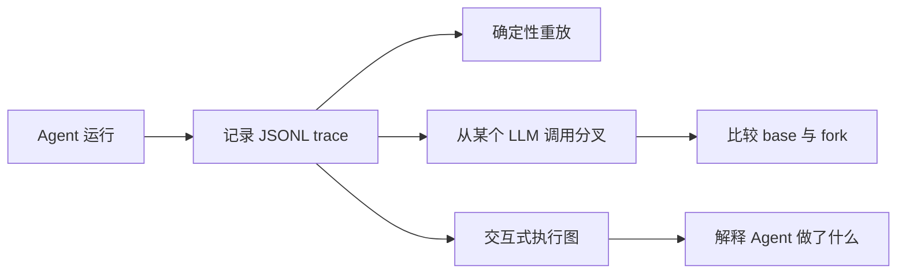

<p align="center">
  <h1 align="center">Replay Agent Recorder</h1>
  <p align="center"><strong>面向 LLM Agent 的本地优先时间旅行调试器。</strong></p>
  <p align="center">
    记录真实 Agent 运行，确定性重放，从任意 LLM 调用处分叉，
    并把模型、工具和文件变化可视化成可交互执行图。
  </p>
</p>

<p align="center">
  <a href="https://github.com/Futuresis/replay-agent-recorder/actions/workflows/ci.yml"></a>
  
  
  
</p>

<p align="center">
  <a href="README.md">English</a>
  ·
  <a href="docs/quickstart.zh-CN.md">快速开始</a>
  ·
  <a href="docs/concepts.zh-CN.md">核心概念</a>
  ·
  <a href="docs/visualization.md">可视化</a>
  ·
  <a href="docs/integrations.md">集成</a>
</p>

---

## 为什么需要这个项目？

LLM Agent 很难调试：一次运行里可能包含非确定性的模型输出、工具调用、重试、并发分支、文件修改，以及不同框架自己的控制流。

**Replay Agent Recorder 会把一次 Agent 运行变成结构化 trace，让你可以检查、重放、分叉、比较和分享。**



它适合帮你回答这些问题：

| 问题 | Replay 可以帮你 |
|---|---|
| Agent 为什么选择了这个工具？ | 查看真实 prompt、模型响应、工具参数和工具输出。 |
| 能不能稳定复现一次偶发失败？ | 复用记录里的模型和工具输出，不再依赖新的模型调用。 |
| 如果某次 LLM 输出不同，后续会怎样？ | 从该 LLM 断点 fork，并比较后续路径。 |
| base run 和 fork run 到底哪里不同？ | 导出 changed、unchanged、new、missing、downstream 节点的执行图。 |
| 不想把 trace 上传到 SaaS，可以本地调试吗？ | trace 是本地 JSONL 文件，HTML 报告可以离线打开。 |

---

## 核心能力

| 能力 | 说明 |
|---|---|
| **Record** | 记录 OpenAI 兼容 chat completion、本地工具调用、语义事件、异步分支和沙箱文件变化。 |
| **Replay** | 复用已记录的 LLM / tool 输出，确定性复现一次 Agent 运行。 |
| **Fork** | 从选定的 LLM 断点开始，用新的输出、assistant message 或请求输入创建分叉。 |
| **Visualize** | 导出 summary JSON、Graph IR JSON、Mermaid 或离线 HTML explorer。 |
| **Integrate** | 提供轻量 API、CLI runner、工具适配器、sandbox helper 和集成脚手架。 |

Replay 是 **local-first** 的：trace 默认就是磁盘上的文件。它适合开发调试、prompt 实验、eval trace 生成，以及 Agent 行为审查。

> **状态：** alpha。核心 record / replay / fork / graph 工作流已经可用，但公开 API 和生成式 integration wrapper 后续仍可能调整。

---

## 5 分钟跑通，无需 API Key

维护中的主示例是 `test_agent/agent4`。它默认使用 fake LLM，因此不需要网络访问，也不消耗模型额度。

```bash
git clone https://github.com/Futuresis/replay-agent-recorder.git
cd replay-agent-recorder

python -m venv .venv
source .venv/bin/activate
python -m pip install -U pip
python -m pip install -e ".[dev]"
```

Windows PowerShell：

```powershell
python -m venv .venv
.venv\Scripts\Activate.ps1
python -m pip install -U pip
python -m pip install -e ".[dev]"
```

记录、重放，然后导出离线 HTML 图：

```bash
python -m test_agent.agent4.replay_runner \
  --mode record \
  --run-id agent4-demo \
  --log-dir .replay/runs \
  --output test_agent/agent4/outputs/record.md

python -m test_agent.agent4.replay_runner \
  --mode replay \
  --run-id agent4-demo \
  --log-dir .replay/runs \
  --output test_agent/agent4/outputs/replay.md

python -m replay graph html .replay/runs/agent4-demo.jsonl \
  --output out/agent4-demo.html
```

预期结果：

- `.replay/runs/agent4-demo.jsonl` 是结构化 trace。
- `record.md` 和 `replay.md` 会得到相同的确定性 synthesis。
- `out/agent4-demo.html` 可以在浏览器里离线打开。

从某个 LLM 断点创建 fork：

```bash
python -m test_agent.agent4.replay_runner \
  --mode replay \
  --run-id agent4-demo \
  --log-dir .replay/runs \
  --breakpoint-record-uid rec_000001 \
  --override-output "manual seed override" \
  --fork-run agent4-demo-fork \
  --output test_agent/agent4/outputs/fork.md

python -m replay graph html .replay/runs/agent4-demo.jsonl \
  --fork .replay/runs/agent4-demo-fork.jsonl \
  --output out/agent4-demo-compare.html
```

更多示例见：[快速开始](docs/quickstart.zh-CN.md) 和 [Agent4 示例说明](test_agent/agent4/README.md)。

---

## 在自己的 Agent 中使用

在进程启动附近安装 Replay：

```python
import replay

replay.install(project_root=".")
```

记录一次运行：

```python
with replay.record("run-A", log_dir=".replay/runs"):
    await main()
```

重放同一次运行：

```python
with replay.replay(base_run="run-A", log_dir=".replay/runs"):
    await main()
```

从某个 LLM 调用处分叉：

```python
with replay.replay(
    base_run="run-A",
    log_dir=".replay/runs",
    breakpoint_record_uid="rec_000003",
    override_output="Try the narrower search query instead.",
    fork_run="run-A-fork-001",
):
    await main()
```

对普通 Python 脚本，CLI 通常已经够用：

```bash
replay record run-A path/to/agent.py -- --agent-arg value
replay replay run-A path/to/agent.py -- --agent-arg value
replay fork run-A \
  --breakpoint-record-uid rec_000003 \
  --override-output "new assistant text" \
  path/to/agent.py -- --agent-arg value
```

---

## 记录本地工具调用

`replay.install()` 会自动 patch LLM 调用，但本地工具需要通过 Replay 的工具协议或 adapter 接入。

```python
result = await replay.invoke_tool(
    "search",
    {"query": "replay debugging for agents"},
    lambda: search({"query": "replay debugging for agents"}),
    namespace="local",
    version="v1",
)
```

registry 或 method-shaped client 可以用内置 adapter：

```python
adapter = replay.MappingToolAdapter(tool_registry, namespace="local")
adapter.install()

method_adapter = replay.MethodToolAdapter(client, "call_tool", namespace="mcp")
method_adapter.install()
```

如果工具会修改本地文本文件，请放进显式 sandbox：

```python
with replay.managed_sandbox(
    base_root="agent/sandbox_base",
    work_root="agent/sandbox",
) as capture:
    adapter = replay.MethodToolAdapter(
        client,
        "call_tool",
        namespace="workspace",
        fs_capture=capture,
    )
    adapter.install()

    with replay.record("run-A", log_dir=".replay/runs"):
        await main()
```

详细 adapter 写法见：[工具适配器协议](docs/tool-adapter-protocol.md)。

---

## 可视化 trace

Replay 可以把一个或多个 JSONL trace 转成多种图格式。

```bash
python -m replay graph summary .replay/runs/agent4-demo.jsonl
python -m replay graph export-ir .replay/runs/agent4-demo.jsonl --output out/graph.json
python -m replay graph mermaid .replay/runs/agent4-demo.jsonl --group-by run --output out/graph.md
python -m replay graph html .replay/runs/agent4-demo.jsonl --output out/graph.html
```

HTML explorer 是静态、只读、可离线打开的页面。它支持搜索、过滤、focus、时间线导航、节点/边详情、evidence 视图，以及 base/fork diff 高亮。

如果想使用 React/XYFlow viewer，需要安装 Node 依赖并重新构建 vendored assets：

```bash
npm install
npm run build:xyflow-viewer
python -m replay graph html .replay/runs/agent4-demo.jsonl \
  --renderer xyflow \
  --output out/graph-xyflow.html
```

完整说明见：[Visualization guide](docs/visualization.md)。

---

## 内置集成 wrapper

Replay 包含一些 wrapper 模板，面向“用户已经在本地 checkout 了目标 Agent 项目”的场景。Replay 不会 vendor 这些项目；你需要传入 `--target-root`，必要时再传 `--entry`。

| Integration | 状态 | 用途 |
|---|---|---|
| `integrations/my_agent` | template | 自定义集成 wrapper 起点。 |
| `integrations/deepagents` | experimental wrapper | 面向已有 DeepAgents checkout 的 best-effort wrapper。 |
| `integrations/open_deep_research` | experimental wrapper | 面向 Open Deep Research 风格项目的 best-effort wrapper。 |
| `integrations/open_swe` | experimental wrapper | 面向 Open SWE 风格项目的 best-effort wrapper。 |
| `integrations/swe_agent` | experimental wrapper | 面向 SWE-agent 风格项目的 best-effort wrapper。 |

生成自己的 wrapper：

```bash
python -m replay scaffold integration \
  --name my-agent \
  --tool-style method \
  --framework auto
```

在生产环境依赖 wrapper 前，建议先阅读：[集成说明](docs/integrations.md) 和 [Scaffold guide](docs/integration-scaffold.md)。

---

## 仓库结构

```text
replay/                    框架包和 CLI
test_agent/agent4/          维护中的确定性 demo agent
integrations/               生成式和内置 wrapper scaffold
docs/                       用户指南和参考说明
guidance/visualization/     原始可视化实现说明
viewer/                     React/XYFlow viewer 源码
replay/xyflow_assets/       package 中携带的 viewer assets
```

更深的实现说明见：[核心概念与架构](docs/concepts.zh-CN.md) 和 [原 README 细节归档](docs/original-readme-details.md)。

---

## 隐私与安全

Replay trace 可能包含敏感信息：

- prompt 和模型输出
- 工具参数和工具返回值
- 本地文件路径
- 文件内容或 diff
- 异常信息和错误细节
- Agent 处理过的业务或用户数据

不要把真实业务 trace 直接提交到公开仓库。公开 issue、示例或测试最好使用 synthetic trace，或者先完成审查与脱敏。

更多说明见：[Security and privacy](docs/security-and-privacy.md) 和 [SECURITY.md](SECURITY.md)。

---

## 当前限制

- 目前只直接 patch OpenAI SDK `chat.completions.create`。
- 暂不支持 streaming response。
- 本地工具必须通过 Replay 工具协议或 adapter 才会被记录。
- 工具输入输出必须是 JSON-like 且可序列化。
- 文件系统捕获只支持显式 sandbox 内的普通文本文件。
- breakpoint 当前面向 LLM records。
- `override_input` 是浅层 kwargs merge。
- 静态 HTML explorer 不会直接执行 replay 或 fork。
- 直接 HTTP 调用和非 OpenAI SDK client 需要自定义 adapter 或 patch 层。

详见：[限制与路线图](docs/limitations.md)。

---

## 开发

在激活的虚拟环境里运行重点检查：

```bash
python -m compileall -q replay integrations test_agent
python -m replay.tests.smoke_test
python -m replay.tests.tool_test
python -m replay.tests.ast_provenance_test
python -m replay.tests.test_graph_ir
python -m replay.tests.test_visualize_cli
python -m replay.tests.test_visualize_html
```

修改 `viewer/` 后重建 viewer assets：

```bash
npm install
npm run build:xyflow-viewer
```

贡献说明：[CONTRIBUTING.md](CONTRIBUTING.md)。

---

## License

MIT. See [LICENSE](LICENSE).
