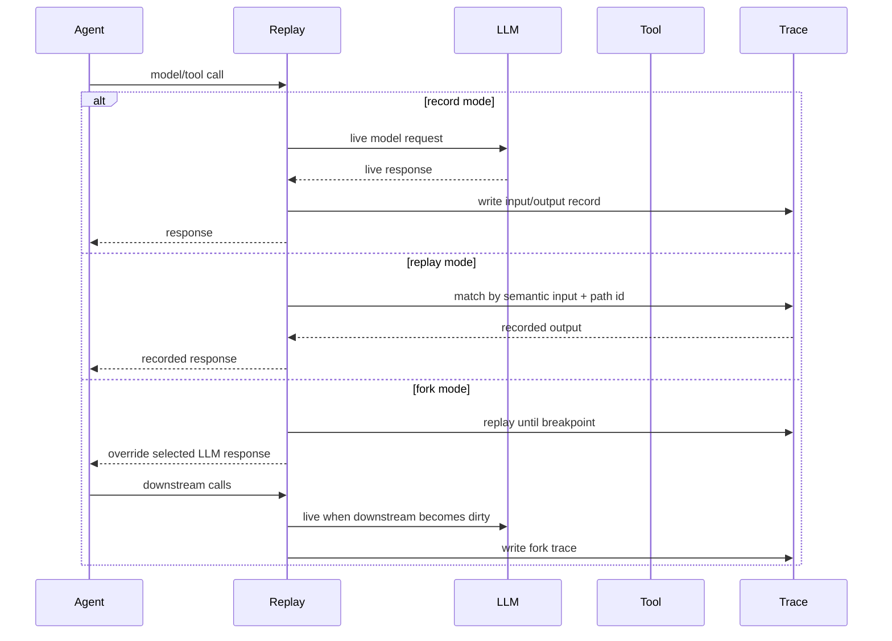

# Concepts and architecture

Replay Agent Recorder is built around one idea: an agent run should be inspectable and reproducible.

A run is recorded as JSONL. Each line is a structured record for a model call, tool call, branch event, filesystem effect, provenance edge, or metadata event. Replay uses those records to match later calls and return recorded outputs instead of calling live systems.

## Core terms

| Term | Meaning |
|---|---|
| **Run** | One recorded or replayed execution of an agent workflow. |
| **Trace** | The JSONL file that stores records for a run. |
| **Record mode** | Calls live LLMs/tools, captures their inputs and outputs, and writes a trace. |
| **Replay mode** | Reuses recorded outputs when matching calls are encountered. |
| **Fork** | A replay that diverges at a selected LLM record by replacing output, assistant message, or request input. |
| **Breakpoint** | A recorded LLM call identified by a record uid such as `rec_000003`. |
| **Path id** | A stable branch-local path identifier used to disambiguate concurrent calls. |
| **Semantic provenance** | Optional AST-level metadata that links prompts, arguments, branches, calls, and outputs. |
| **Graph IR** | A normalized graph representation used to export Mermaid and HTML views. |

## Record, replay, fork



## What is implemented

- Recording and replaying OpenAI SDK `chat.completions.create` calls, including sync and async paths.
- Stable matching of replay records by normalized semantic input plus `path_id` disambiguation for concurrent branches.
- Async branch tracking for `asyncio.gather`, `asyncio.create_task`, and `asyncio.TaskGroup.create_task`.
- Local tool recording through `invoke_tool`, `invoke_tool_sync`, `MappingToolAdapter`, `MethodToolAdapter`, and `ClassMethodToolAdapter`.
- Replaying tool outputs and recorded tool exceptions.
- Sandboxed text-file effect capture and replay for create, modify, and delete operations.
- Managed sandbox reset helpers so record and replay start from a clean base directory.
- Breakpoint forks from LLM records with `override_output`, `override_message`, or `override_input`.
- Optional AST-level provenance instrumentation that records data/control edges between LLM calls, tool calls, prompts, arguments, and branch conditions.
- Graph exports from JSONL traces: summary JSON, Graph IR JSON, Mermaid, and an offline interactive HTML explorer.
- Base/fork visualization metadata for changed, unchanged, new, missing, and downstream nodes.
- A deterministic Agent4 workflow covering LLM calls, local tools, sandboxed file effects, forks, and visualization metadata.

## Repository layout

```text
replay/
  api.py                    public API: install, record, replay, tools, sandboxes
  cli.py                    command line interface
  context.py                record/replay sessions, path allocation, breakpoints, JSONL writing
  openai_patch.py           OpenAI SDK chat completion patching
  asyncio_patch.py          async branch path tracking
  tools.py                  invoke_tool and invoke_tool_sync
  tool_adapters.py          MappingToolAdapter, MethodToolAdapter, ClassMethodToolAdapter
  filesystem_effects.py     sandboxed file effect capture and replay
  sandbox_manager.py        managed sandbox reset helpers
  instrument.py             AST provenance instrumentation
  import_hook.py            import-time instrumentation hook
  semantic_runtime.py       provenance runtime
  graph_ir.py               trace-to-graph conversion
  visualize.py              Mermaid and HTML exporters
  xyflow_assets/            bundled React/XYFlow viewer assets

test_agent/agent4/          maintained deterministic demo agent
integrations/               wrapper scaffolds and generated integration examples
docs/                       user-facing guides
docs/architecture/          implementation notes and internal contracts
viewer/                     React/XYFlow viewer source
```

## Public API boundary

Prefer importing from the top-level `replay` package. The names exported by `replay.__all__` are the recommended public API for the alpha release. Internal modules may change without compatibility guarantees.

Common top-level imports:

```python
import replay

replay.install()
replay.record(...)
replay.replay(...)
replay.invoke_tool(...)
replay.invoke_tool_sync(...)
replay.MappingToolAdapter(...)
replay.MethodToolAdapter(...)
replay.managed_sandbox(...)
```

## LLM calls

Replay currently patches OpenAI SDK chat completions. After `replay.install()`, supported calls are captured in record mode and matched in replay mode.

Matching uses normalized request information plus branch/path context. This is important because concurrent agents may call the same model from the same callsite with different branch histories.

## Tool calls

Replay does not know where your local tools execute unless you route them through the Replay tool protocol or install an adapter.

Use direct wrapping for simple tools:

```python
result = await replay.invoke_tool(
    "lookup",
    {"query": query},
    lambda: lookup(query),
    namespace="local",
    version="v1",
)
```

Use adapters when your tools are organized as registries or clients:

```python
replay.MappingToolAdapter(tool_registry, namespace="local").install()
replay.MethodToolAdapter(client, "call_tool", namespace="mcp").install()
```

Tool inputs and outputs should be JSON-like. Complex SDK objects should be converted to dictionaries at the tool boundary.

## Filesystem effects

Filesystem capture is explicit and sandboxed. It is designed for ordinary text files under a known working directory.

```python
with replay.managed_sandbox(
    base_root="agent/sandbox_base",
    work_root="agent/sandbox",
) as capture:
    adapter = replay.MethodToolAdapter(
        client,
        "call_tool",
        namespace="workspace",
        fs_capture=capture,
    )
    adapter.install()
```

Record mode captures file creates, modifications, and deletes. Replay mode validates the pre-state hash, applies recorded file effects, and returns the recorded tool output.

## Async branches and path ids

Replay tracks common asyncio branch creation APIs so that parallel branches receive stable path identifiers. This reduces ambiguity when multiple similar calls happen concurrently.

Supported branch tracking includes:

- `asyncio.gather`
- `asyncio.create_task`
- `asyncio.TaskGroup.create_task`

## Graph model

Graph export reads one or more JSONL traces and produces Graph IR. Graph IR can then be rendered as:

- summary JSON
- raw Graph IR JSON
- Mermaid Markdown
- standalone HTML

For base/fork comparisons, the graph contains diff metadata such as changed, unchanged, new, missing, and downstream.

## Packaging notes

The source repository keeps development tests under `replay/tests/`, but release wheels exclude `replay.tests*`. Vendored visualization assets under `replay/xyflow_assets/` are included in the package.

The maintained repository demo `test_agent/agent4/` is a repo-level demo, not a Python package API. Use it after cloning the repository. For installed-library usage, integrate through `import replay` or the `replay` CLI.
