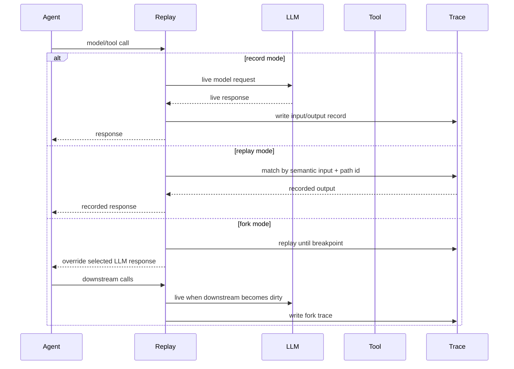

# 核心概念与架构

Replay Agent Recorder 的核心目标很简单：一次 Agent 运行应该可以被检查、被复现、被分叉。

一次运行会被记录成 JSONL。每一行是一个结构化 record，可能代表模型调用、工具调用、分支事件、文件系统效果、provenance edge 或 metadata event。Replay 会用这些 record 在后续运行中匹配调用，并返回已记录的输出，而不是再次调用真实系统。

## 核心术语

| 术语 | 含义 |
|---|---|
| **Run** | 一次被 record 或 replay 的 Agent 执行。 |
| **Trace** | 存储 run records 的 JSONL 文件。 |
| **Record mode** | 调用真实 LLM / tool，捕获输入输出，并写入 trace。 |
| **Replay mode** | 遇到匹配调用时，复用 trace 中的记录输出。 |
| **Fork** | 在某个 LLM record 处分叉，用新的输出、assistant message 或 request input 替换原调用。 |
| **Breakpoint** | 被记录的 LLM 调用，例如 `rec_000003`。 |
| **Path id** | 用来区分并发调用的稳定 branch-local path 标识。 |
| **Semantic provenance** | 可选 AST 级元数据，用来连接 prompt、参数、分支、调用和输出。 |
| **Graph IR** | 用于导出 Mermaid 和 HTML 的标准化图表示。 |

## Record、Replay、Fork



## 已实现能力

- 记录和重放 OpenAI SDK `chat.completions.create` 调用，支持 sync 和 async 路径。
- 通过归一化语义输入和 `path_id` 区分并发分支下的 replay records。
- 跟踪 `asyncio.gather`、`asyncio.create_task` 和 `asyncio.TaskGroup.create_task` 创建的异步分支。
- 通过 `invoke_tool`、`invoke_tool_sync`、`MappingToolAdapter`、`MethodToolAdapter` 和 `ClassMethodToolAdapter` 记录本地工具调用。
- 重放工具输出和已记录的工具异常。
- 捕获并重放 sandbox 内普通文本文件的 create、modify、delete 效果。
- 提供 managed sandbox reset helper，让 record 和 replay 都从干净 base directory 开始。
- 从 LLM records 创建 breakpoint fork，支持 `override_output`、`override_message` 或 `override_input`。
- 可选 AST 级 provenance instrumentation，用来记录 LLM 调用、工具调用、prompt、参数和分支条件之间的数据/控制依赖。
- 从 JSONL trace 导出 summary JSON、Graph IR JSON、Mermaid 和离线交互式 HTML explorer。
- 支持 base/fork 可视化 diff metadata，包括 changed、unchanged、new、missing 和 downstream nodes。
- 维护中的 Agent4 deterministic workflow，覆盖 LLM 调用、本地工具、sandbox 文件效果、fork 和可视化 metadata。

## 仓库结构

```text
replay/
  api.py                    public API: install, record, replay, tools, sandboxes
  cli.py                    命令行入口
  context.py                record/replay session、路径分配、断点、JSONL 写入
  openai_patch.py           OpenAI SDK chat completion patch
  asyncio_patch.py          async branch path tracking
  tools.py                  invoke_tool 和 invoke_tool_sync
  tool_adapters.py          MappingToolAdapter、MethodToolAdapter、ClassMethodToolAdapter
  filesystem_effects.py     sandbox 文件效果捕获和重放
  sandbox_manager.py        managed sandbox reset helper
  instrument.py             AST provenance instrumentation
  import_hook.py            import-time instrumentation hook
  semantic_runtime.py       provenance runtime
  graph_ir.py               trace-to-graph conversion
  visualize.py              Mermaid 和 HTML exporters
  xyflow_assets/            bundled React/XYFlow viewer assets

test_agent/agent4/          维护中的 deterministic demo agent
integrations/               wrapper scaffolds 和生成式 integration examples
docs/                       用户文档
guidance/visualization/     原始可视化说明和 quickstart
viewer/                     React/XYFlow viewer 源码
```

## Public API 边界

建议从顶层 `replay` package 导入。`replay.__all__` 中导出的名字是 alpha release 推荐的 public API。内部模块后续可能变化，不保证兼容。

常见导入：

```python
import replay

replay.install()
replay.record(...)
replay.replay(...)
replay.invoke_tool(...)
replay.invoke_tool_sync(...)
replay.MappingToolAdapter(...)
replay.MethodToolAdapter(...)
replay.managed_sandbox(...)
```

## LLM 调用

Replay 当前 patch OpenAI SDK chat completions。调用 `replay.install()` 后，record mode 会捕获支持的调用，replay mode 会匹配并复用记录。

匹配逻辑使用归一化 request 信息和 branch/path context。这对于并发 Agent 很重要，因为多个相似调用可能来自同一 callsite，但属于不同分支历史。

## 工具调用

Replay 不会自动知道本地工具在哪里执行。你需要把工具接入 Replay 工具协议，或者安装 adapter。

简单工具可以直接包一层：

```python
result = await replay.invoke_tool(
    "lookup",
    {"query": query},
    lambda: lookup(query),
    namespace="local",
    version="v1",
)
```

如果工具是 registry 或 client：

```python
replay.MappingToolAdapter(tool_registry, namespace="local").install()
replay.MethodToolAdapter(client, "call_tool", namespace="mcp").install()
```

工具输入输出应该是 JSON-like。复杂 SDK 对象建议在工具边界转换成 dict。

## 文件系统效果

文件系统捕获是显式、sandboxed 的，适合已知工作目录下的普通文本文件。

```python
with replay.managed_sandbox(
    base_root="agent/sandbox_base",
    work_root="agent/sandbox",
) as capture:
    adapter = replay.MethodToolAdapter(
        client,
        "call_tool",
        namespace="workspace",
        fs_capture=capture,
    )
    adapter.install()
```

record mode 会捕获文件 create、modify、delete。replay mode 会校验 pre-state hash，应用已记录的文件效果，然后返回已记录的工具输出。

## 异步分支和 path id

Replay 会跟踪常见 asyncio 分支创建 API，让并行分支获得稳定 path id。这可以降低多个相似调用并发出现时的匹配歧义。

支持的 branch tracking 包括：

- `asyncio.gather`
- `asyncio.create_task`
- `asyncio.TaskGroup.create_task`

## Graph model

Graph export 读取一个或多个 JSONL traces，然后生成 Graph IR。Graph IR 可以渲染成：

- summary JSON
- raw Graph IR JSON
- Mermaid Markdown
- standalone HTML

对于 base/fork 对比，graph 会包含 changed、unchanged、new、missing、downstream 等 diff metadata。

## Packaging notes

源码仓库保留 `replay/tests/` 用于开发，但 release wheel 会排除 `replay.tests*`。`replay/xyflow_assets/` 下的 vendored visualization assets 会包含在 package 中。

维护中的仓库 demo `test_agent/agent4/` 是 repo-level demo，不是 Python package API。clone 仓库后可以运行它；作为已安装 library 使用时，建议通过 `import replay` 或 `replay` CLI 接入。
